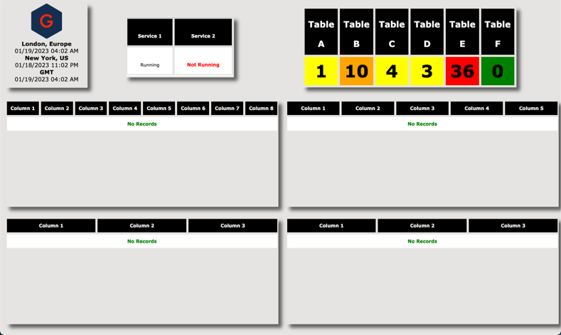

# Audit Dashboards
Connect to database tables in order to display record counts and play audible threshold alerts.



## Getting Started
- Adjust the ```Audit_Dashboard.php``` file to change the refresh rate of the data when its visible.
- Adjust the ```Audit_Dashboard.html``` file to flip through multiple dashboards within a specificed time range.
- Go to the full ``Audit_Dashboard.html`` web server address in your web browser.

## Deployment
- Specify your database connection and queries in the php file.
- I strongly recommend including ``WHERE`` and ``LIMIT`` clauses to minimize the result set loading times.
- Run the ```Audit_Dashboard_Demo.php``` in your browser to get a static demo of what the webpage will look like when running properly.
- Feel free to add your company's logo by replacing the ``logo.png`` file.

-----

## Credit
**Author:** Scott Grivner <br>
**Email:** scott.grivner@gmail.com <br>
**Website:** [scottgrivner.dev](https://www.scottgriv.dev) <br>
**Reference:** [Main Branch](https://github.com/scottgriv/php-audit_dashboards)
